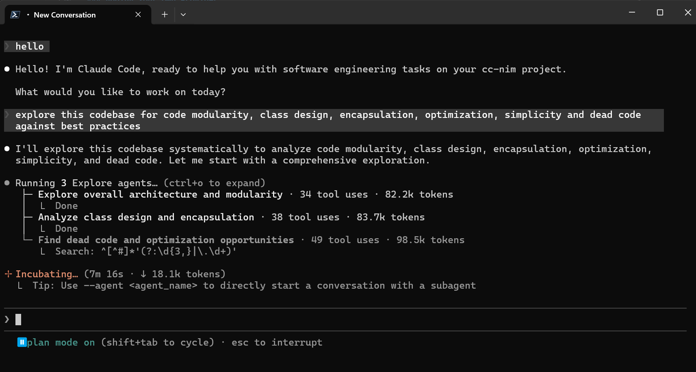

# cc-nim

**Free Claude Code CLI via NVIDIA NIM API** — A lightweight proxy that converts Anthropic API requests to NVIDIA NIM format. Includes Telegram bot integration for remote task management.



## Features

- 🚀 **Zero-cost Claude Code** — Use NVIDIA's free 40 req/min API
- 📱 **Telegram Bot** — Send tasks remotely, monitor progress from your phone
- 🔄 **Real-time Streaming** — See thinking tokens, tool calls, and results as they happen
- 🛡️ **Production-Ready** — Rate limiting, circuit breakers, and error handling built-in

---

## Quick Start

### Prerequisites

1. Get a free NVIDIA API key from [build.nvidia.com/settings/api-keys](https://build.nvidia.com/settings/api-keys)
2. Install [claude-code](https://github.com/anthropics/claude-code)
3. Install [uv](https://github.com/astral-sh/uv)

### Installation

```bash
git clone https://github.com/Alishahryar1/cc-nim.git
cd cc-nim
cp .env.example .env
```

Edit `.env` with your API key:

```dotenv
NVIDIA_NIM_API_KEY=nvapi-your-key-here
MODEL=moonshotai/kimi-k2-thinking
```

### Run

**Terminal 1 — Start the proxy:**

```bash
uv run uvicorn server:app --host 0.0.0.0 --port 8082
```

**Terminal 2 — Run Claude Code:**

```bash
ANTHROPIC_AUTH_TOKEN=ccnim ANTHROPIC_BASE_URL=http://localhost:8082 claude
```

That's it — Claude Code now runs through NVIDIA NIM for free.

---

## Telegram Bot Integration

Control Claude Code remotely via Telegram. Send tasks from your phone and watch autonomous execution with real-time updates.

### Setup

1. **Create a bot** — Message [@BotFather](https://t.me/BotFather), send `/newbot`, and copy the API token

2. **Get your user ID** — Message [@userinfobot](https://t.me/userinfobot)

3. **Add to `.env`:**

```dotenv
TELEGRAM_BOT_TOKEN=123456789:ABCdefGHIjklMNOpqrSTUvwxYZ
ALLOWED_TELEGRAM_USER_ID=your_telegram_user_id
CLAUDE_WORKSPACE=./agent_workspace
ALLOWED_DIR=/path/to/your/projects
```

4. **Start the server** and message your bot with a task

### Telegram Features

- 💭 **Thinking tokens** — See reasoning steps in real-time
- 🔧 **Tool calls** — Watch file operations as they execute  
- ✅ **Final results** — Get notified when tasks complete
- `/stop` — Cancel all running tasks

---

## Available Models

See [`nvidia_nim_models.json`](nvidia_nim_models.json) for all supported models.

**Recommended:**

| Model | Best For |
|-------|----------|
| `moonshotai/kimi-k2-thinking` | Complex reasoning (default) |
| `stepfun-ai/step-3.5-flash` | Fast responses |
| `moonshotai/kimi-k2.5` | General purpose |
| `mistralai/devstral-2-123b-instruct-2512` | Code tasks |

Browse all models at [build.nvidia.com/explore/discover](https://build.nvidia.com/explore/discover)

### Update Model List

```bash
curl "https://integrate.api.nvidia.com/v1/models" > nvidia_nim_models.json
```

---

## Configuration

### Core Settings

| Variable | Description | Default |
|----------|-------------|---------|
| `NVIDIA_NIM_API_KEY` | Your NVIDIA API key | **required** |
| `MODEL` | Model for all requests | `moonshotai/kimi-k2-thinking` |
| `CLAUDE_WORKSPACE` | Agent workspace directory | `./agent_workspace` |
| `ALLOWED_DIR` | Allowed directories for agent | `""` |
| `MAX_CLI_SESSIONS` | Max concurrent CLI sessions | `10` |

### Performance Optimizations

| Variable | Description | Default |
|----------|-------------|---------|
| `FAST_PREFIX_DETECTION` | Enable fast prefix detection | `true` |
| `ENABLE_NETWORK_PROBE_MOCK` | Enable network probe mock | `true` |
| `ENABLE_TITLE_GENERATION_SKIP` | Skip title generation | `true` |
| `ENABLE_SUGGESTION_MODE_SKIP` | Skip suggestion mode | `true` |
| `ENABLE_FILEPATH_EXTRACTION_MOCK` | Enable filepath extraction mock | `true` |

### Rate Limiting

| Variable | Description | Default |
|----------|-------------|---------|
| `NVIDIA_NIM_RATE_LIMIT` | API requests per window | `40` |
| `NVIDIA_NIM_RATE_WINDOW` | Rate limit window (seconds) | `60` |
| `MESSAGING_RATE_LIMIT` | Telegram messages per window | `1` |
| `MESSAGING_RATE_WINDOW` | Messaging window (seconds) | `1` |

### NVIDIA NIM Parameters

All `NVIDIA_NIM_*` settings are strictly validated. Key options:

| Variable | Description | Default |
|----------|-------------|---------|
| `NVIDIA_NIM_TEMPERATURE` | Sampling temperature | `1.0` |
| `NVIDIA_NIM_TOP_P` | Top-p nucleus sampling | `1.0` |
| `NVIDIA_NIM_MAX_TOKENS` | Max tokens for generation | `81920` |
| `NVIDIA_NIM_REASONING_EFFORT` | Reasoning effort | `high` |
| `NVIDIA_NIM_INCLUDE_REASONING` | Include reasoning in response | `true` |
| `NVIDIA_NIM_PARALLEL_TOOL_CALLS` | Parallel tool calls | `true` |

See [`.env.example`](.env.example) for all supported parameters.

---

## Development

### Run Tests

```bash
uv run pytest
```

### Add a Custom Provider

Extend [`BaseProvider`](providers/base.py):

```python
from providers.base import BaseProvider, ProviderConfig

class MyProvider(BaseProvider):
    async def complete(self, request):
        # Make API call, return raw JSON
        pass

    async def stream_response(self, request, input_tokens=0):
        # Yield Anthropic SSE format events
        pass

    def convert_response(self, response_json, original_request):
        # Convert to Anthropic response format
        pass
```

### Add a Messaging Platform

Extend [`MessagingPlatform`](messaging/base.py):

```python
from messaging.base import MessagingPlatform
from messaging.models import IncomingMessage

class MyPlatform(MessagingPlatform):
    async def start(self):
        # Initialize connection
        pass

    async def stop(self):
        # Cleanup
        pass

    async def queue_send_message(self, chat_id, text, **kwargs):
        # Send message to platform
        pass

    async def queue_edit_message(self, chat_id, message_id, text, **kwargs):
        # Edit existing message
        pass

    def on_message(self, handler):
        # Register callback for incoming messages
        pass
```

---

## License

MIT License — See [LICENSE](LICENSE) for details.
