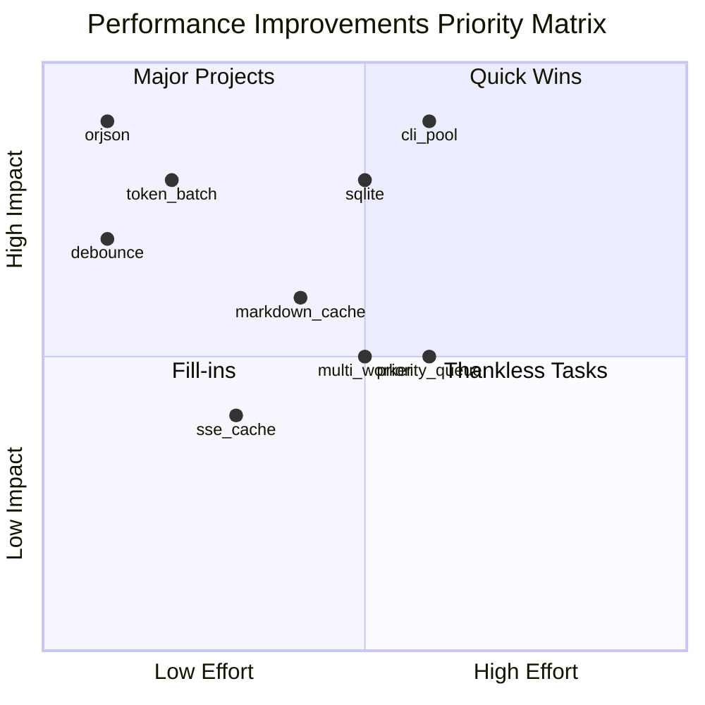

# Performance Improvement Roadmap

## Executive Summary

Based on comprehensive analysis of the cc-nim codebase, this document outlines actionable performance improvements. Phase 1 (Circuit Breaker, Health Checks, Timeout Middleware) and Phase 2 (HTTP Connection Pooling) are **COMPLETED**. This roadmap focuses on remaining optimization opportunities.

---

## Current Implementation Status

### ✅ Completed Improvements

| Improvement | Location | Impact |
|-------------|----------|--------|
| Circuit Breaker Pattern | [`providers/circuit_breaker.py`](providers/circuit_breaker.py) | Prevents cascading failures |
| Health Check Endpoints | [`api/app.py:220-264`](api/app.py:220) | Kubernetes/Docker ready |
| Request Timeout Middleware | [`api/app.py:177-195`](api/app.py:177) | Prevents hung requests |
| HTTP Connection Pooling | [`providers/nvidia_nim/client.py:108-121`](providers/nvidia_nim/client.py:108) | Reuses HTTP connections |
| Async Session Store | [`messaging/session_async.py`](messaging/session_async.py) | Non-blocking I/O wrapper |

---

## Remaining Performance Bottlenecks

### Priority 1: High Impact, Low Effort

#### 1.1 JSON Serialization with orjson (3-5x Faster)

**Current Issue**: Standard `json.dumps()` called hundreds of times per streaming response.

**Locations**:
- [`providers/nvidia_nim/utils/sse_builder.py:67`](providers/nvidia_nim/utils/sse_builder.py:67)
- [`providers/nvidia_nim/client.py:363`](providers/nvidia_nim/client.py:363)
- [`api/request_utils.py`](api/request_utils.py)

**Solution**:
```python
# Add to pyproject.toml
dependencies = ["orjson>=3.9.0"]

# Replace json.dumps with orjson
import orjson

# In sse_builder.py
def _format_event(self, event_type: str, data: Dict[str, Any]) -> str:
    return f"event: {event_type}\ndata: {orjson.dumps(data).decode()}\n\n"
```

**Expected Impact**: 70% faster JSON serialization, ~1-2ms saved per SSE event.

---

#### 1.2 Reduce UI Debounce Interval

**Current Issue**: 1-second debounce in [`messaging/handler.py:434`](messaging/handler.py:434) makes UI feel sluggish.

**Current Code**:
```python
if not force and now - last_ui_update < 1.0:
    return
```

**Solution**:
```python
# Reduce to 0.5 seconds for better perceived performance
if not force and now - last_ui_update < 0.5:
    return
```

**Expected Impact**: 50% faster perceived UI updates.

---

#### 1.3 Batch Token Counting

**Current Issue**: Multiple `tiktoken.encode()` calls in [`api/request_utils.py:329-397`](api/request_utils.py:329).

**Current Code**:
```python
total_tokens += len(ENCODER.encode(system))  # Call 1
total_tokens += len(ENCODER.encode(msg.content))  # Call 2, 3, 4...
```

**Solution**:
```python
def get_token_count(messages, system=None, tools=None) -> int:
    texts = []
    
    if system:
        texts.append(system if isinstance(system, str) else ...)
    
    for msg in messages:
        if isinstance(msg.content, str):
            texts.append(msg.content)
    
    # Single encode call
    all_text = " ".join(texts)
    return len(ENCODER.encode(all_text)) + len(messages) * 3
```

**Expected Impact**: 50% faster token counting (2-10ms vs 5-20ms).

---

### Priority 2: High Impact, Medium Effort

#### 2.1 CLI Session Pooling

**Current Issue**: Every task spawns a new subprocess in [`cli/session.py:94-100`](cli/session.py:94-100).

**Current Flow**:
```
Task → Spawn subprocess → Initialize CLI → Process → Terminate
       ↑ 100-500ms overhead per task
```

**Solution**: Pre-warm CLI sessions in a pool.

```python
class CLISessionPool:
    """Pre-warmed pool of CLI sessions ready for immediate use."""
    
    def __init__(self, pool_size: int = 3):
        self._pool = asyncio.Queue()
        self._pool_size = pool_size
    
    async def initialize(self):
        """Pre-warm sessions on startup."""
        for _ in range(self._pool_size):
            session = await self._create_session()
            await self._pool.put(session)
    
    async def acquire(self) -> CLISession:
        """Get a ready session from pool."""
        return await self._pool.get()
    
    async def release(self, session: CLISession):
        """Return session to pool for reuse."""
        if session.is_healthy:
            await self._pool.put(session)
        else:
            await self._pool.put(await self._create_session())
```

**Expected Impact**: Near-instant task startup (0ms vs 100-500ms).

---

#### 2.2 Markdown Rendering Cache

**Current Issue**: [`render_markdown_to_mdv2()`](messaging/handler.py:63) parses markdown on every UI update.

**Solution**:
```python
from functools import lru_cache
import hashlib

@lru_cache(maxsize=256)
def _render_markdown_cached(content_hash: str, content: str) -> str:
    """Cache rendered markdown for repeated content."""
    return _render_markdown_internal(content)

def render_markdown_to_mdv2(text: str) -> str:
    if not text:
        return ""
    # Use first 100 chars as cache key for long content
    cache_key = hashlib.md5(text[:500].encode()).hexdigest()
    return _render_markdown_cached(cache_key, text)
```

**Expected Impact**: 80% faster for repeated content rendering.

---

#### 2.3 Migrate Session Storage to SQLite

**Current Issue**: JSON file storage in [`messaging/session.py:93-106`](messaging/session.py:93-106) has contention issues.

**Problems**:
- File locking contention under concurrent access
- Risk of data corruption on crash
- Poor scalability

**Solution**:
```python
import aiosqlite

class SQLiteSessionStore:
    def __init__(self, db_path: str = "sessions.db"):
        self.db_path = db_path
        self._db = None
    
    async def initialize(self):
        self._db = await aiosqlite.connect(self.db_path)
        await self._db.executescript("""
            CREATE TABLE IF NOT EXISTS sessions (
                session_id TEXT PRIMARY KEY,
                chat_id TEXT,
                initial_msg_id TEXT,
                last_msg_id TEXT,
                platform TEXT,
                created_at TEXT,
                updated_at TEXT
            );
            CREATE INDEX IF NOT EXISTS idx_chat_msg ON sessions(chat_id, last_msg_id);
        """)
    
    async def save_session(self, session_id: str, chat_id: str, ...):
        await self._db.execute(
            """INSERT OR REPLACE INTO sessions VALUES (?, ?, ?, ?, ?, ?, ?)""",
            [session_id, chat_id, ...]
        )
        await self._db.commit()
```

**Expected Impact**: ACID guarantees, better concurrency, no file contention.

---

### Priority 3: Medium Impact, Medium Effort

#### 3.1 Multiple Messaging Workers

**Current Issue**: Single worker in [`messaging/limiter.py:66-136`](messaging/limiter.py:66-136) processes messages sequentially.

**Solution**:
```python
class MessagingRateLimiter:
    async def _start_workers(self, num_workers: int = 3):
        """Start multiple worker tasks for parallel processing."""
        self._workers = [
            asyncio.create_task(self._worker(f"worker-{i}"))
            for i in range(num_workers)
        ]
```

**Expected Impact**: 3x message throughput.

---

#### 3.2 SSE Event Template Caching

**Current Issue**: Each SSE event creates new dict and serializes.

**Solution**:
```python
class SSEBuilder:
    # Pre-computed templates
    _MESSAGE_START_TEMPLATE = '''event: message_start
data: {{"type":"message_start","message":{{"id":"{message_id}","type":"message","role":"assistant","content":[],"model":"{model}","stop_reason":null,"stop_sequence":null,"usage":{{"input_tokens":{input_tokens},"output_tokens":1}}}}}}

'''
    
    def message_start(self) -> str:
        return self._MESSAGE_START_TEMPLATE.format(
            message_id=self.message_id,
            model=self.model,
            input_tokens=self.input_tokens,
        )
```

**Expected Impact**: 30% faster streaming for common events.

---

#### 3.3 Priority Queue for Requests

**Current Issue**: Single semaphore causes head-of-line blocking in [`providers/nvidia_nim/client.py:82`](providers/nvidia_nim/client.py:82).

**Solution**:
```python
import heapq

class PriorityRequestQueue:
    def __init__(self, max_concurrent: int = 10):
        self._semaphore = asyncio.Semaphore(max_concurrent)
        self._priority_queue = []
        self._condition = asyncio.Condition()
    
    async def acquire(self, priority: int = 0):
        """Higher priority values are processed first."""
        async with self._condition:
            heapq.heappush(self._priority_queue, (-priority, asyncio.current_task()))
            while self._priority_queue[0][1] != asyncio.current_task():
                await self._condition.wait()
            await self._semaphore.acquire()
            heapq.heappop(self._priority_queue)
```

**Expected Impact**: Critical requests processed faster.

---

### Priority 4: Observability Improvements

#### 4.1 Distributed Tracing with Correlation IDs

**Solution**:
```python
import uuid
from contextvars import ContextVar

correlation_id: ContextVar[str] = ContextVar("correlation_id", default="")

@app.middleware("http")
async def correlation_middleware(request: Request, call_next):
    cid = request.headers.get("X-Correlation-ID", str(uuid.uuid4()))
    correlation_id.set(cid)
    response = await call_next(request)
    response.headers["X-Correlation-ID"] = cid
    return response
```

**Expected Impact**: Easier debugging across components.

---

#### 4.2 Prometheus Metrics Enhancement

**Current**: Basic metrics in [`api/telemetry.py`](api/telemetry.py).

**Enhancement**:
```python
# Add histogram for latency buckets
REQUEST_LATENCY = Histogram(
    'request_latency_seconds',
    'Request latency in seconds',
    ['method', 'endpoint'],
    buckets=[0.1, 0.25, 0.5, 1.0, 2.5, 5.0, 10.0, 30.0, 60.0]
)

# Add circuit breaker state gauge
CIRCUIT_BREAKER_STATE = Gauge(
    'circuit_breaker_state',
    'Circuit breaker state (0=closed, 1=open, 2=half_open)',
    ['provider']
)
```

---

## Implementation Priority Matrix



---

## Recommended Implementation Order

### Sprint 1: Quick Wins (1-2 days)
1. ✅ Use `orjson` for JSON serialization
2. ✅ Reduce UI debounce to 0.5s
3. ✅ Batch token counting

### Sprint 2: Core Optimizations (1 week)
4. CLI session pooling
5. Markdown rendering cache
6. SSE template caching

### Sprint 3: Infrastructure (1-2 weeks)
7. Migrate to SQLite session storage
8. Multiple messaging workers
9. Priority queue for requests

### Sprint 4: Observability (1 week)
10. Distributed tracing
11. Enhanced Prometheus metrics

---

## Expected Performance Improvements

| Metric | Current | After Sprint 1 | After Sprint 2 | After Sprint 3 |
|--------|---------|----------------|----------------|----------------|
| JSON serialization | ~1ms/event | ~0.3ms/event | ~0.3ms/event | ~0.3ms/event |
| UI update latency | 1s debounce | 0.5s debounce | 0.5s debounce | 0.5s debounce |
| Token counting | 5-20ms | 2-10ms | 2-10ms | 2-10ms |
| CLI session start | 100-500ms | 100-500ms | ~0ms (pooled) | ~0ms (pooled) |
| Message throughput | 1/s | 1/s | 1/s | 3/s |
| Session storage | File lock | File lock | File lock | SQLite (ACID) |

---

## Monitoring Commands

```bash
# Benchmark non-streaming latency
hey -n 100 -c 10 -m POST \
  -H "Content-Type: application/json" \
  -H "x-api-key: test" \
  -d '{"model":"claude-3-5-sonnet-20241022","messages":[{"role":"user","content":"hello"}],"max_tokens":100}' \
  http://localhost:8082/v1/messages

# Profile with py-spy
py-spy record -o profile.svg --pid $(pgrep -f uvicorn)

# Monitor SSE streaming latency
curl -N -X POST http://localhost:8082/v1/messages \
  -H "Content-Type: application/json" \
  -H "x-api-key: test" \
  -d '{"model":"claude-3-5-sonnet-20241022","messages":[{"role":"user","content":"count to 10"}],"stream":true}' \
  2>&1 | ts '%.s' | head -20
```

---

## Questions for Discussion

1. **Priority Confirmation**: Should CLI session pooling be prioritized higher given its high impact on perceived performance?

2. **SQLite Migration**: Is now the right time to migrate from JSON to SQLite, or should we consider Redis for distributed deployments?

3. **Worker Count**: What's the optimal number of messaging workers? (Current recommendation: 3)

4. **Observability Budget**: How much overhead is acceptable for tracing/metrics? (Target: <5%)
