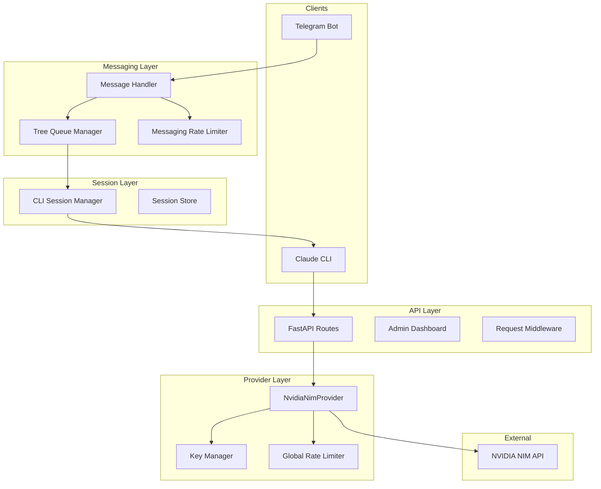
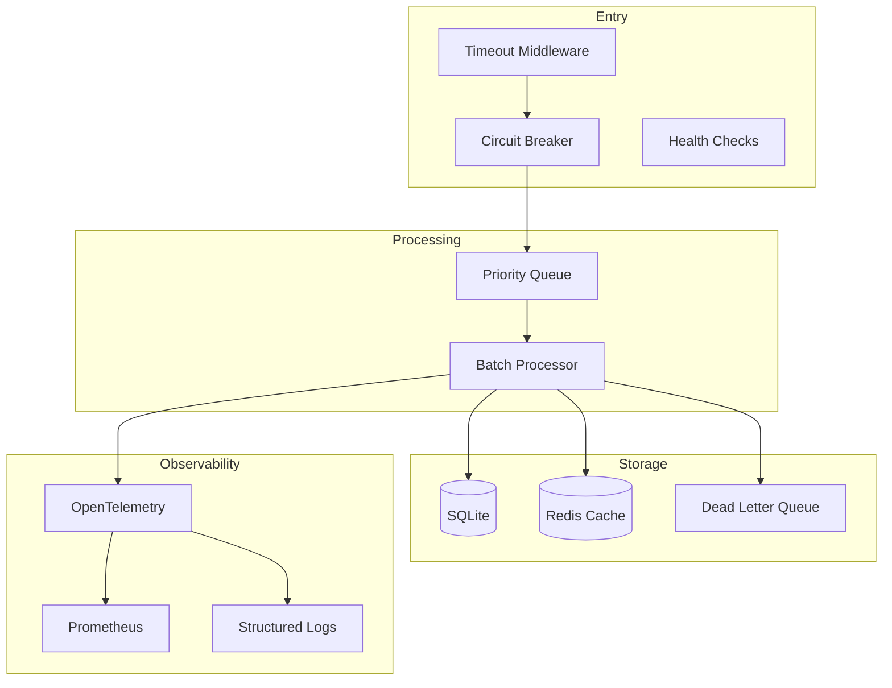

# Claude Code Proxy - Performance & Reliability Analysis

## Executive Summary

This document provides a comprehensive analysis of the Claude Code Proxy system's performance and reliability characteristics, along with actionable recommendations for improvement.

**Status: IMPLEMENTED** - Phase 1 and Phase 2 improvements have been implemented.

---

## Implementation Summary

### Phase 1: Critical Fixes ✅ COMPLETED

| Improvement | File | Description |
|-------------|------|-------------|
| Health Check Endpoints | [`api/app.py:192-227`](api/app.py:192) | Added `/health` and `/ready` endpoints for Kubernetes/Docker orchestration |
| Request Timeout Middleware | [`api/app.py:175-191`](api/app.py:175) | Added timeout middleware to prevent hung requests (default 300s) |
| Circuit Breaker Pattern | [`providers/circuit_breaker.py`](providers/circuit_breaker.py) | Full circuit breaker implementation with CLOSED/OPEN/HALF_OPEN states |
| Async Session Store | [`messaging/session_async.py`](messaging/session_async.py) | Async I/O version with backward-compatible sync wrapper |

### Phase 2: Performance Improvements ✅ COMPLETED

| Improvement | File | Description |
|-------------|------|-------------|
| HTTP Connection Pooling | [`providers/nvidia_nim/client.py:107-120`](providers/nvidia_nim/client.py:107) | Shared httpx.AsyncClient with configurable pool limits |
| Configuration Updates | [`config/settings.py:82-89`](config/settings.py:82) | New settings for circuit breaker and connection pooling |

---

## System Architecture Overview



---

## Performance Analysis

### Current Strengths

1. **Multi-Key Rotation**: The [`NimKeyManager`](providers/nvidia_nim/key_manager.py:26) implements intelligent key selection with load balancing
2. **Model Fallback Chain**: Automatic fallback through multiple models on failure
3. **Request Semaphores**: Concurrency control via [`asyncio.Semaphore`](providers/nvidia_nim/client.py:80)
4. **Task Compaction**: Message queue deduplication in [`MessagingRateLimiter`](messaging/limiter.py:17)
5. **Streaming Support**: Efficient SSE streaming for responses

### Performance Issues Identified

#### 1. Synchronous I/O in Session Store [HIGH IMPACT]

**Location**: [`messaging/session.py:40-49`](messaging/session.py:40)

**Problem**: The `SessionStore` uses `threading.Lock` and synchronous file I/O operations that can block the async event loop.

```python
# Current implementation blocks event loop
def _save(self) -> None:
    with open(self.storage_path, "w", encoding="utf-8") as f:
        json.dump(data, f, indent=2)
```

**Impact**: Under high load, file I/O can block the entire application for milliseconds.

**Recommendation**: 
- Use `aiofiles` for async file I/O
- Replace `threading.Lock` with `asyncio.Lock`
- Consider using SQLite or Redis for session storage

---

#### 2. No Connection Pooling for HTTP Clients [MEDIUM IMPACT]

**Location**: [`providers/nvidia_nim/client.py:100-118`](providers/nvidia_nim/client.py:100)

**Problem**: Each API key creates a separate `AsyncOpenAI` client without explicit connection pooling configuration.

```python
self._client_cache: dict[str, AsyncOpenAI] = {self._api_key: self._client}
```

**Impact**: Connection overhead for each request, especially with multiple keys.

**Recommendation**:
- Configure explicit connection pool limits
- Use `httpx` with custom connection pool settings
- Consider connection reuse across keys

---

#### 3. In-Memory Telemetry Without Persistence [LOW IMPACT]

**Location**: [`api/telemetry.py:12-29`](api/telemetry.py:12)

**Problem**: All metrics are stored in memory with `deque(maxlen=5000)`, losing historical data and metrics on restart.

**Impact**: Limited observability, no historical trend analysis.

**Recommendation**:
- Integrate with Prometheus remote write
- Add optional persistence layer
- Consider OpenTelemetry integration

---

#### 4. JSON File-Based Session Storage [HIGH IMPACT]

**Location**: [`messaging/session.py:93-106`](messaging/session.py:93)

**Problem**: Session data stored in a single JSON file, creating contention and potential corruption.

**Impact**: 
- File locking contention under concurrent access
- Risk of data corruption on crash
- Poor scalability

**Recommendation**:
- Migrate to SQLite for ACID guarantees
- Consider Redis for distributed deployments
- Implement write-ahead logging

---

#### 5. No Request Batching [MEDIUM IMPACT]

**Location**: [`api/routes.py:37-131`](api/routes.py:37)

**Problem**: Each request is processed independently without batching capability.

**Impact**: Higher overhead for multiple small requests.

**Recommendation**:
- Implement request coalescing for similar operations
- Add batch endpoint for multiple messages

---

#### 6. Semaphore Head-of-Line Blocking [MEDIUM IMPACT]

**Location**: [`providers/nvidia_nim/client.py:80`](providers/nvidia_nim/client.py:80)

**Problem**: Single semaphore for all requests can cause head-of-line blocking.

```python
self._request_semaphore = asyncio.Semaphore(self._max_in_flight)
```

**Impact**: Long-running requests can block shorter ones.

**Recommendation**:
- Implement priority queue for requests
- Consider fair queuing algorithm
- Add request timeout at semaphore level

---

## Reliability Analysis

### Current Strengths

1. **Multi-Key Fallback**: Automatic key rotation on rate limits
2. **Model Fallback Chain**: Tries multiple models before failing
3. **Error Classification**: Proper error mapping in [`errors.py`](providers/nvidia_nim/errors.py:15)
4. **Graceful Shutdown**: Lifespan manager handles cleanup

### Reliability Issues Identified

#### 1. No Circuit Breaker Pattern [HIGH IMPACT]

**Location**: [`providers/nvidia_nim/client.py:209-468`](providers/nvidia_nim/client.py:209)

**Problem**: Continuous retries on failing endpoints without circuit breaker.

**Impact**: Cascading failures, resource exhaustion.

**Recommendation**:
```python
# Implement circuit breaker
class CircuitBreaker:
    def __init__(self, failure_threshold=5, recovery_timeout=30):
        self.failure_count = 0
        self.failure_threshold = failure_threshold
        self.recovery_timeout = recovery_timeout
        self.state = "closed"  # closed, open, half-open
```

---

#### 2. No Health Check Endpoints [MEDIUM IMPACT]

**Location**: [`api/app.py`](api/app.py)

**Problem**: Missing `/health` and `/ready` endpoints for orchestration.

**Impact**: Cannot properly monitor service health in Kubernetes/Docker.

**Recommendation**:
```python
@app.get("/health")
async def health():
    return {"status": "healthy"}

@app.get("/ready")
async def ready():
    # Check provider connectivity
    # Check key manager status
    return {"status": "ready"}
```

---

#### 3. Inconsistent Retry Logic [MEDIUM IMPACT]

**Location**: [`providers/nvidia_nim/resilience.py:55-73`](providers/nvidia_nim/resilience.py:55)

**Problem**: Retry logic exists but is not consistently applied across all code paths.

**Impact**: Some failures may not be retried appropriately.

**Recommendation**:
- Standardize retry decorator
- Use tenacity library for consistent retries
- Add retry configuration to settings

---

#### 4. No Dead Letter Queue [MEDIUM IMPACT]

**Location**: [`messaging/handler.py:392-569`](messaging/handler.py:392)

**Problem**: Failed messages are marked as ERROR but not persisted for retry.

**Impact**: Message loss on permanent failures.

**Recommendation**:
- Implement dead letter queue
- Add manual retry mechanism
- Store failed messages for analysis

---

#### 5. Singleton Pattern Issues [MEDIUM IMPACT]

**Location**: [`providers/rate_limit.py:22-55`](providers/rate_limit.py:22)

**Problem**: Singleton pattern for rate limiters can cause issues in multi-worker deployments.

```python
_instance: Optional["GlobalRateLimiter"] = None
```

**Impact**: State inconsistency across workers.

**Recommendation**:
- Use Redis-backed rate limiting for distributed deployments
- Make singleton pattern configurable
- Document single-worker limitation

---

#### 6. No Request Timeout at Middleware Level [HIGH IMPACT]

**Location**: [`api/app.py:176-190`](api/app.py:176)

**Problem**: Request timeout only at provider level, not at middleware level.

**Impact**: Hung requests can consume resources indefinitely.

**Recommendation**:
```python
@app.middleware("http")
async def timeout_middleware(request: Request, call_next):
    try:
        return await asyncio.wait_for(call_next(request), timeout=300.0)
    except asyncio.TimeoutError:
        return JSONResponse(status_code=504, content={"error": "Request timeout"})
```

---

#### 7. No Distributed Tracing [LOW IMPACT]

**Location**: Throughout the codebase

**Problem**: No correlation IDs or distributed tracing support.

**Impact**: Difficult to debug issues across components.

**Recommendation**:
- Add correlation ID middleware
- Integrate OpenTelemetry
- Add trace context propagation

---

#### 8. No Graceful Degradation [MEDIUM IMPACT]

**Location**: [`messaging/handler.py:251-348`](messaging/handler.py:251)

**Problem**: System fails hard when components are unavailable.

**Impact**: Complete service unavailability on partial failures.

**Recommendation**:
- Implement fallback responses
- Add feature flags for degraded mode
- Queue messages for later processing

---

## Prioritized Implementation Plan

### Phase 1: Critical Fixes [Immediate]

| Priority | Issue | Effort | Impact |
|----------|-------|--------|--------|
| 1 | Add health check endpoints | Low | High |
| 2 | Add request timeout middleware | Low | High |
| 3 | Fix synchronous I/O in SessionStore | Medium | High |
| 4 | Implement circuit breaker | Medium | High |

### Phase 2: Performance Improvements [Short-term]

| Priority | Issue | Effort | Impact |
|----------|-------|--------|--------|
| 5 | Migrate session storage to SQLite | Medium | High |
| 6 | Configure HTTP connection pooling | Low | Medium |
| 7 | Implement priority queue for requests | Medium | Medium |
| 8 | Add request batching | Medium | Medium |

### Phase 3: Reliability Enhancements [Medium-term]

| Priority | Issue | Effort | Impact |
|----------|-------|--------|--------|
| 9 | Implement dead letter queue | Medium | Medium |
| 10 | Add distributed tracing | Medium | Medium |
| 11 | Standardize retry logic | Low | Medium |
| 12 | Add graceful degradation | Medium | Medium |

### Phase 4: Observability & Scaling [Long-term]

| Priority | Issue | Effort | Impact |
|----------|-------|--------|--------|
| 13 | Redis-backed rate limiting | Medium | Medium |
| 14 | OpenTelemetry integration | Medium | Low |
| 15 | Metrics persistence | Low | Low |

---

## Recommended Architecture Improvements



---

## Configuration Recommendations

### Environment Variables to Add

```bash
# Circuit Breaker
CIRCUIT_BREAKER_THRESHOLD=5
CIRCUIT_BREAKER_RECOVERY_TIMEOUT=30

# Request Timeout
REQUEST_TIMEOUT_SECONDS=300

# Session Storage
SESSION_STORAGE_TYPE=sqlite  # or redis
SESSION_STORAGE_PATH=./data/sessions.db

# Connection Pooling
HTTP_MAX_CONNECTIONS=100
HTTP_MAX_KEEPALIVE_CONNECTIONS=20

# Health Check
HEALTH_CHECK_ENABLED=true
```

---

## Monitoring Recommendations

### Key Metrics to Track

1. **Request Latency**: P50, P95, P99 latencies
2. **Error Rates**: By error type and endpoint
3. **Key Health**: Per-key availability and rate limit status
4. **Queue Depth**: Message queue backlog
5. **Circuit Breaker State**: Open/closed transitions
6. **Session Count**: Active CLI sessions

### Alerts to Configure

1. High error rate (>5% over 5 minutes)
2. Circuit breaker open
3. All keys rate limited
4. Queue depth exceeding threshold
5. Session limit reached

---

## Conclusion

The Claude Code Proxy has a solid foundation with multi-key rotation and model fallback. The primary areas for improvement are:

1. **Async I/O**: Eliminate blocking operations
2. **Circuit Breakers**: Prevent cascading failures
3. **Persistent Storage**: Move from JSON files to SQLite/Redis
4. **Observability**: Add health checks and distributed tracing
5. **Graceful Degradation**: Handle partial failures

Implementing these recommendations will significantly improve both performance and reliability, especially under high load conditions.
